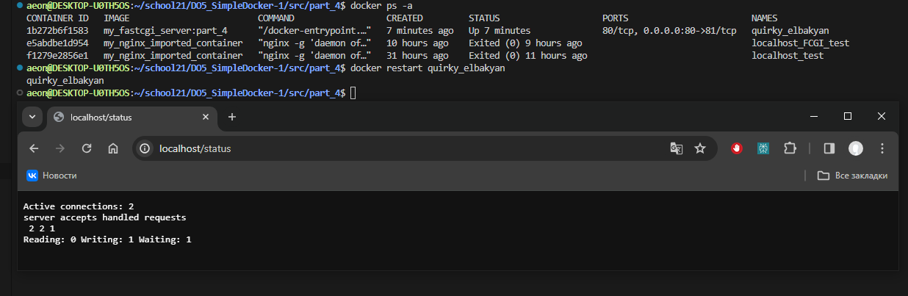

  


## Содержание DO5_SimpleDocker  

* [Реализованные требования к проекту](#реализованные-требования-к-проекту)  
* [Part 1: готовый докер](#part-1-готовый-докер)  
* [Part 2: операции с контейнером](#part-2-операции-с-контейнером)  
* [Part 3: мини веб-сервер](#part-3-мини-веб-сервер)  
* [Part 4: свой докер](#part-4-свой-докер)  
* [Part 5: dockle](#part-5-dockle)  
* [Part 6: базовый Docker Compose](#part-6-базовый-docker-compose)  
* [Некоторые полезные команды Docker](#некоторые-полезные-команды-docker)  
* [Некоторые полезные флаги Docker-команд](#некоторые-полезные-флаги-docker-команд)  
* [Некоторые полезные инструкции Dockerfile](#некоторые-полезные-инструкции-dockerfile)  
* [Материалы, прочитанные и просмотренные, во время и для выполнения задания](#материалы-прочитанные-и-просмотренные-во-время-и-для-выполнения-задания)   


## Реализованные требования к проекту

По Part 1 и Part 2 предоставлен отчет.  
По Part 3 предоставлены исходные файлы для запуска веб-сервера.  
По Part 4 и Part 5 предоставлены докерфайлы.  
По Part 6 предоставлен файл *docker-compose.yml* и нужные для его запуска докерфайлы (если они не были предоставлены ранее).  

- В папку src, загружен отчёт с именем `README.md`;
- В отчёте все части задания выделены как заголовки 2-го уровня;
- В рамках одной части задания всё, что помещается в отчёт, оформлено в виде списка;
- Каждый скриншот в отчёте кратко подписан (что показано на скриншоте);
- Все скриншоты обрезаны так, чтобы была видна только нужная часть экрана;
- В папку src/server, загружены исходные файлы для запуска веб-сервера из Part 3;
- В папку src загружены итоговые докерфайлы для запуска образов из Part 4 и Part 5;
- В папку src загружен *docker-compose.yml* из Part 6;


## Part 1. Готовый докер

<details>
  <summary>Установка Docker и запуск первого образа</summary>
</p>

Скачал и установил Docker Desktop, связал с wsl   
   
  
Скачал образ nginx при помощи `sudo docker pull` и проверил командой `sudo docker  images`   
     


Запустил докер-образ nginx через `docker run -d nginx` и проверил, что образ запустился командой `docker ps`   
  
 
</p>
</details>


<details>
  <summary>Знакомство с docker inspect</summary>
</p>

Мой контейнер называется *heuristic_babbage*, поэтому далее для работы с ним буду использовать это имя.  
Использовал `docker inspect -s heuristic_babbage`, выделил на скринах *размер*, *список замапленных портов* и *ip контейнера*        
   
  
  

> Пояснения к `docker inspect`  
>  
> Понятие **замапленные порты** в контексте Docker относится к процессу связывания портов контейнера с портами хост-системы.   
Это позволяет внешним приложениям и пользователям общаться с приложениями внутри контейнера через указанные порты.  
**Найти список замапленных портов можно в "NetworkSettings -> Ports"**.   
**Не путать с "ExposedPorts" в "Config"!**   
"ExposedPorts" из "Config" определяет, какие порты в контейнере могут быть доступны для связи с внешними приложениями.   
Он, по сути, документирует, какие порты должны быть доступны для связи, но не обязательно означает, что они являются открытыми для связи с внешним миром.  
"Ports" из "NetworkSettings" отображает реальное количество портов между контейнером и хост-системой.  
Он показывает, какие порты были открыты и замаплены для связи с контейнером извне.  
"ExposedPorts" определяет, какие порты подразумевается открыть для связи,   
в то время как "Ports" показывает, какие порты фактически открыты и замаплены на хост-систему.    
> 
> **Размер контейнера можно узнать в разделе "GraphDriver -> SizeRw"**.   
Параметр "SizeRw" (Read-Write size) отражает объем данных, который был записан в файловую систему контейнера.   
Этот размер включает в себя любые изменения, которые произошли во время работы контейнера, например, запись файлов, модификация данных и т.д. 
**Не путать с ShmSize!**  
Параметр "ShmSize" в контексте Docker относится к размеру разделяемой(дополнительной) памяти (Shared Memory) в байтах, выделенной для контейнера.   
Разделяемая память используется для обмена данными между процессами в пределах контейнера и может быть полезной для оптимизации производительности некоторых приложений.  
При создании контейнера в Docker можно указать параметр `shm-size` для определения размера разделяемой памяти, доступной внутри контейнера.   
Этот параметр может использоваться, например, для управления размером разделяемой памяти, доступной для процессов, работающих внутри контейнера.   
**Не путать с SizeRootFs!**   
Этот параметр указывает на размер образа, из которого подняли контейнер.  

**В выводе `docker inspect` не может содержаться информация о размере, для этого нужно вводить эту команду с ключом `-s`**.  


Проверил размер в человекочитаемом виде командами `docker ps -s` и `docker container ls -s`   

> **Самый простой способ узнать размер контейнера в человекочитаемом виде, это команды `docker ps -s` или `docker container ls -s`**  
Они предоставляют список всех запущенных контейнеров вместе с информацией о их размере.   
Флаг `-s` указывает Docker на вывод добавочной информации о размерах контейнеров, включая реальные размеры используемых образов и файловых систем контейнеров.  
Первое значение отражает текущий размер файлов контейнера и их использование в файловой системе.  
Второе значение в скобках *(virtual ХХХMB)* указывает на размер образа, из которого подняли контейнер.  
Эти команды позволяют узнать как фактический размер файлов контейнера в операционной системе, так и объем доступной виртуальной памяти, выделенной контейнеру для использования.  
 
</p>
</details>


<details>
  <summary>Проброс портов HTTP и HTTPS</summary>
</p>

Остановил докер образ через `docker stop heuristic_babbage` и проверил через `docker ps`  
  


Запустил докер контейнер с портами 80 и 443, замапленными на такие же порты на локальной машине, через команду `docker run -d -p 80:80 -p 443:443 --name localhost_test nginx`  
С помощью `--name localhost_test` присвоил контейнеру имя при создании  
Проверил, что в браузере по адресу *localhost:80* доступна стартовая страница **nginx**  
  

Проверил изменения через `docker inspect localhost_test | grep -A 18 '"NetworkSettings": {'`  
Часть с `grep -A 18 '"NetworkSettings": {'` позволяет отфильтровать вывод по сетевым настройкам   
Ключ `-A` используется для указания числа строк, которые следует вывести после обнаружения совпадения  
  

> Пояснения к `docker run -d -p 80:80 -p 443:443`  
Порты 80(HTTP) и 443(HTTPS) являются стандартными портами для HTTP и HTTPS. Веб-серверы обычно слушают входящие запросы на этих портах.  
При прокидывании портов 80 и 443 из контейнера на эти же порты локальной машины, мы перенаправляем входящий сетевой трафик на соответствующие порты в Docker контейнере, где запущен веб-сервер.  
Это позволяет сайту, развернутому в контейнере, быть доступным снаружи по адресу *localhost:80*.   
В браузере, при переходе по адресу "localhost:80", мы обращаемся к порту 80 на своей локальной машине, который сопоставлен с портом 80 внутри контейнера.  
А уже контейнер Nginx обрабатывает запрос и отображает стартовую страницу на порту 80.  


Перезапустил докер контейнер через `docker restart localhost_test` и проверил, что контейнер перезапустился   
  
 
</p>
</details>


## Part 2. Операции с контейнером  

<details>
  <summary>Копаемся в файлах конфигурации Nginx</summary>
</p>


> Команда exec в контексте Docker используется для выполнения команды внутри запущенного контейнера.  
Чтобы прочитать конфигурационный файл nginx.conf внутри Docker контейнера через команду exec, использовал `docker exec localhost_test cat /etc/nginx/nginx.conf`  
   


> Файл nginx.conf включает конфигурацию Nginx, веб-сервера с открытым исходным кодом.  
> Вот краткое объяснение содержания файла:   
> 
> - `user nginx;`: определяет, от имени какого пользователя будет работать процесс Nginx.   
Тут Nginx будет работать от имени пользователя "nginx".  
> 
> - `worker_processes auto;`: тут определяется количество рабочих процессов, которые будут обрабатывать веб-запросы.   
Значение "auto" позволяет системе автоматически определить оптимальное количество процессов.
> 
> - `error_log /var/log/nginx/error.log notice;` и `pid /var/run/nginx.pid;`: эти строки определяют местоположение и уровень журнала ошибок и файла PID, который содержит идентификатор процесса Nginx.  
> 
> - `events { ... }`: тут определяются параметры событий, такие как максимальное количество соединений с рабочими процессами.  
> 
> - `http { ... }`: тут содержится основная конфигурация HTTP, включая настройки логирования, типы контента, отправку файлов, тайм-ауты соединений и включение дополнительных модулей конфигурации из директории /etc/nginx/conf.d/*.conf.  

> Объяснение содержимого блока `http { ... }`:  
> 
> - `include /etc/nginx/mime.types;`: позволяет включать файл /etc/nginx/mime.types, который определяет соответствие между типами файлов и их расширениями.  
> 
> - `default_type application/octet-stream;`: тут определяется тип контента по умолчанию для ответов сервера.   
В данном случае, если тип файла не может быть определён, он будет обработан как двоичный поток данных.  
> 
> - `log_format main ...`: определение формата журнала доступа.   
В данном случае, основной формат включает информацию о запросе, статусе, размере ответа, агенте пользователя и др.  
> 
> - `access_log /var/log/nginx/access.log main;`: тут определяется местоположение файла для журнала доступа и используемый формат.  
> 
> - `sendfile on;`: позволяет использовать системную функцию sendfile для обработки файлов.  
> 
> - `keepalive_timeout 65;`: определяет таймаут для keep-alive соединений, то есть период ожидания для новых запросов на уже установленном соединении.  
> 
> - `include /etc/nginx/conf.d/*.conf;`: позволяет включать дополнительные модули конфигурации из всех файлов с расширением .conf из директории /etc/nginx/conf.d/.  
> 
</p>
</details>    


<details>
  <summary>Выводим статус сервера на localhost:80/status</summary>
</p>


Создал на локальной машине файл `nginx.conf`, скопировав содержимое файла из аналогичного файла в контейнере.  
Настроил в нем по пути */status* отдачу страницы [статуса сервера](../materials/nginx_status.md) **nginx**, для этого закомментировал строку `# include /etc/nginx/conf.d/*.conf;`   
Так можно позволить Nginx игнорировать дополнительные конфигурационные файлы и использовать только настройки, определенные в основном файле `/etc/nginx/nginx.conf`  
   

> 
> - `location /status { ... }`: начинает блок конфигурации для обработки запросов к пути /status.
> 
> - `stub_status on;`: включает отдачу статуса сервера Nginx по пути /status.

> Статус сервера в контексте Nginx представляет собой информацию о текущей нагрузке и работоспособности сервера.   
Это может включать в себя информацию о количестве активных соединений, загруженности сервера, статистику запросов и другие параметры, которые могут быть полезны для мониторинга и анализа работы сервера.  
> 
> Путь /status представляет собой URL-адрес, по которому можно получить эту информацию.   
При настройке Nginx для отдачи информации о статусе сервера, обращение по этому пути будет возвращать указанную информацию о текущем состоянии сервера.    

Скопировал созданный файл *nginx.conf* внутрь докер-образа через команду `docker cp nginx.conf localhost_test:/etc/nginx/nginx.conf`  
Проверил, что файл скопировался через `docker exec localhost_test cat /etc/nginx/nginx.conf`    
Перезапустил **nginx** внутри докер-образа через команду `docker exec localhost_test nginx -s reload`  
Проверил, что по адресу `localhost:80/status` выдается страничка со статусом сервера **nginx**.  
   

</p>
</details>  


<details>
  <summary>Сохраняем настройки с помощью export и import</summary>
</p>

Экспортировал контейнер в архив *container.tar* командой `docker export localhost_test > container.tar`  
Остановил контейнер командой `docker stop localhost_test`, проверил статус командой `docker ps -a`   
Удалил образ через `docker rmi -f nginx`, проверил через `docker images`     
Удалил остановленный контейнер командой `docker rm localhost_test`, проверил через `docker ps -a`  
Импортировал контейнер обратно командой `docker import --change 'CMD ["nginx", "-g", "daemon off;"]' container.tar my_nginx_imported_container`    
Запустил импортированный контейнер командой `docker run -d -p 80:80 -p 443:443 --name localhost_test my_nginx_imported_container`    
Проверил, что по адресу *localhost:80/status* выдается страничка со статусом сервера **nginx**.  
   


> Пояснения к команде export  
> Экспортирование контейнера в файл с помощью команды docker export полезно в нескольких сценариях:
> 
> - Создание резервной копии: с помощью этой команды можно сделать копию состояния контейнера.   
Это полезно, если важно сохранить текущее состояние приложения или данных в контейнере.  
> 
> - Передача файлов на другую машину: можно передать файлы из контейнера на другой компьютер, просто переместив тар-архив.   
Это можно сделать без использования Docker на другой машине для восстановления контейнера.  
> 
> - Изучение и анализ файловой системы контейнера: экспортирование контейнера позволяет проанализировать его файловую систему за пределами Docker.   
Это может быть полезно для изучения структуры файлов или поиска и устранения проблем.  


> Пояснения к команде import  
> Команда docker import в Docker используется для создания нового образа контейнера из архива файла, созданного с помощью docker export.   
Она позволяет импортировать файловую систему контейнера из архива tar и создать новый образ на его основе.   
Это может быть полезно, например, когда необходимо создать образ из файловой системы контейнера, предоставив возможность подключения к другим контейнерам.  

> CMD - это инструкция Dockerfile, которая определяет команду, которая будет выполнена по умолчанию, когда контейнер запускается без указания другой команды.  
> В данном случае, `CMD ["nginx", "-g", "daemon off;"]` задает команду запуска контейнера Nginx с параметрами, чтобы он работал в переднем плане без использования демона.  
> **Символы ', ", []**:  
> * `'`: одиночные кавычки используются в командной строке для задания начала и конца строки параметров.  
> * `"`: двойные кавычки обрамляют строки параметров внутри квадратных скобок и помогают определить строки в более структурированной форме.  
> * `[]`: квадратные скобки используются для создания массивов параметров в командной строке Dockerfile.  
> 
> **Параметры в квадратных скобках**:  
> В данном контесте параметры `["nginx", "-g", "daemon off;"]` указывают на массив параметров команды.  
> * `"nginx"`: первый элемент массива представляет исполняемую команду или приложение, в данном случае, это команда nginx.  
> * `"-g"`: флаг используется в контексте запуска Nginx для определения глобальных настроек конфигурации. При использовании параметра `-g "daemon off;"`, мы указываем Nginx не запускаться в режиме демона (daemon off), что означает, что Nginx будет работать в переднем плане и не будет форкаться в фоновый режим при запуске контейнера. 
> * `"daemon off;"`: третий элемент массива обозначает дополнительный параметр `-g`, в данном случае, это daemon off;, что указывает на то, что демон будет выключен при работе контейнера Nginx.  

А можно было сразу записать и порты через `docker import --change 'CMD ["nginx", "-g", "daemon off;"]' --change 'EXPOSE 80' --change 'EXPOSE 443' container.tar my_nginx_imported_container` и запускать так `docker run -d --name localhost_test my_nginx_imported_container`  

</p>
</details>


## Part 3. Мини веб-сервер

<details>
  <summary>Немного про FastCGI</summary>
</p>

FastCGI (Fast Common Gateway Interface) - это протокол передачи данных между веб-сервером и программой обработки контента (например, скриптом или приложением), обеспечивающий более эффективную и гибкую обработку запросов по сравнению с оригинальным CGI.  

**Эффективность**:  
FastCGI обеспечивает более эффективную обработку запросов по сравнению с CGI, поскольку позволяет постоянно держать запущенным процесс обработки контента, что устраняет накладные расходы, связанные с многократным запуском и завершением процесса для обработки каждого запроса.  

**Гибкость**:  
Этот протокол также обеспечивает большую гибкость при выборе языка программирования и способа обработки запросов.   
Он позволяет использовать различные языки программирования и технологии обработки контента (например, PHP, Python, Ruby), а также предоставляет возможность масштабирования и управления приложениями более эффективно.  

**Поддержка множества серверов**:  
FastCGI также обеспечивает возможность управления несколькими экземплярами веб-серверов, что делает его подходящим для масштабируемых и распределенных систем.  
Благодаря этим характеристикам FastCGI является популярным выбором для обработки динамического контента, такого как веб-приложения, и обеспечивает эффективное управление трафиком на веб-серверах.  

</p>
</details>

<details>
  <summary>Развернуть отчёт</summary>
</p>

Остановил старый контейнер `docker stop localhost_test`   
Запустил новый с портом 81 `docker run -d -p 80:80 -p 81:81 -p 443:443 --name localhost_FCGI_test my_nginx_imported_container`  

Добавил настройки для прослушивания и перенаправления с порта 81 в *nginx.conf*      

```conf
	server {
		listen 81;  # Указывает на прослушивание порта 81

		location / {
			fastcgi_pass 127.0.0.1:8080;  # Перенаправляет запросы на FastCGI-сервер на порту 8080
			include fastcgi_params;
		}
	}
```

Скопировал свой *nginx.conf* в контейнер `docker cp nginx.conf localhost_FCGI_test:/etc/nginx/nginx.conf`   

Сделал скрипт для запуска FastCGI-сервера и установки зависимостей в контейнере  

```bash
#!/bin/bash

# Обновление списка пакетов в контейнере
apt-get update

# Установка необходимых пакетов для компиляции и работы с FastCGI
apt-get install -y gcc make libfcgi-dev spawn-fcgi

# Создание директории для исходного кода веб-сервера и переход в нее 
mkdir /app
cd /app

# Содержимое исходного кода веб-сервера 
echo '
#include <fcgi_stdio.h> /// упрощает работу с операциями ввода-вывода с интерфейсом, как в stdio.h
#include <fcgiapp.h> /// набор функций для работы с запросами, управления параметрами, заголовками и тд

/**
* @file main.c
* @brief Мини-веб сервер на основе FastCGI
* 
* Мини-веб сервер на FastCGI с возможностью обработки веб-запросов и возвращения HTML-страницы
*/

int main(void) {
   while (FCGI_Accept() >= 0) {
       printf("Content-type: text/html\r\n\r\n"); // Указание типа контента для HTML страницы
       printf("<html><head><title>Hello, World!</title></head><body>"); // Открытие HTML тегов для формирования страницы
       printf("<h1>Hello, World!</h1>"); // Отображение заголовка "Hello, World!"
       printf("</body></html>"); // Закрытие HTML тегов
   }
   return 0;
}
' > server.c

# Компиляция исходного кода веб-сервера на C с FastCGI
gcc -o my_server server.c -lfcgi

# Запуск FastCGI-сервера в фоновом режиме
spawn-fcgi -p 8080 /app/my_server
```
Скопировал скрипт в контейнер `docker cp server/installing_dependencies.sh localhost_FCGI_test:/installing_dependencies.sh`   
Сделал скрипт исполяемым командой `docker exec -it localhost_FCGI_test chmod +x /installing_dependencies.sh`  
Запустил скрипт в контейнере `docker exec -it localhost_FCGI_test /bin/bash -c "/installing_dependencies.sh"` 

  

Перезапустил образ nginx, чтобы изменения вступили в силу `docker exec localhost_FCGI_test nginx -s reload`     
Проверил, что в браузере по *localhost:81* выдается мой хелло-ворлд.  

  
 
</p>
</details>


## Part 4. Свой докер  

<details>
  <summary>Создаём докер-образ для созданного сервера</summary>
</p>

Запилил докерфайл с одним RUN  

```Dockerfile
FROM nginx:latest

COPY nginx.conf /etc/nginx/
COPY server.c /app/

WORKDIR /app

RUN apt-get update && \
    apt-get install -y gcc make libfcgi-dev spawn-fcgi && \
	gcc -o my_server server.c -lfcgi && \
    apt-get clean && rm -rf /var/lib/apt/lists/*

# apt-get clean: удаляет все локальные копии пакетов из папки /var/cache/apt/archives, которые больше не могут быть загружены и использованы
# rm -rf /var/lib/apt/lists/*: удаляет списки пакетов, полученные в результате обновления и установки пакетов. 
# Это помогает уменьшить количество места, занимаемое неиспользуемыми и устаревшими списками 

CMD spawn-fcgi -p 8080 /app/my_server && nginx -g 'daemon off;'
```


Собрал написанный докер-образ через `docker build -t my_fastcgi_server:part_4 .` указав имя и тег   
Проверил через `docker images`, что все собралось корректно  

    

</p>
</details>


<details>
  <summary>Запуск образа с серваком</summary>
</p>


Запустил собранный докер-образ с маппингом 81 порта на 80 на локальной машине и маппингом папки *./nginx* внутрь контейнера по адресу, где лежат конфигурационные файлы **nginx**'а командой `docker run -d -p 80:81 -v "$(pwd)/nginx/nginx.conf:/etc/nginx/nginx.conf" my_fastcgi_server:part_4`  
Проверил, что по *localhost:80* доступна страничка написанного мини сервера   

  

> Монтирование папки при запуске контейнера означает предоставление доступа к папке на хостовой системе изнутри контейнера в момент его запуска.   
Это делается путем связывания (или "монтирования") конкретной директории на хостовой машине с определенным местом в файловой системе контейнера.   
Когда это выполняется, все файлы и папки в указанной директории на хосте становятся доступными внутри контейнера и могут быть использованы при его работе.  
> 
> Монтирование папки при запуске контейнера может быть полезно, например, для следующих целей:  
> **Обмен файлами**: Позволяет обмениваться файлами между хостовой системой и контейнером без необходимости копирования файлов внутрь образа.  
> **Динамическое обновление конфигураций**: Позволяет динамически изменять и обновлять конфигурационные файлы в контейнере без необходимости пересборки образа.  
> **Хранение данных**: Позволяет использовать внешние хранилища данных, например, для сохранения постоянных данных, таких как базы данных и файлы журналов.  
> Использование монтирования папки при запуске контейнера предоставляет гибкость в управлении файлами и данными между хостовой системой и контейнером, что делает его полезным инструментом в разработке, тестировании и эксплуатации контейнеризованных приложений.  

</p>
</details>


<details>
  <summary>Проксирование странички /status</summary>
</p>


Дописал в *./nginx/nginx.conf* проксирование странички */status*, по которой надо отдавать статус сервера **nginx**.

Изменил раздел server в файле nginx.conf  

```conf
  server {
    listen 81;  # Указывает на прослушивание порта 81

    location / {
      fastcgi_pass 127.0.0.1:8080;  # Перенаправляет запросы на FastCGI-сервер на порту 8080
      include fastcgi_params;
    }

    location /status { 
      stub_status; 
    }
  }
```

Перезапустил контейнер командой `docker restart <CONTAINER_NAME>`     
*после сохранения файла и перезапуска контейнера, конфигурационный файл внутри докер-образа обновился*  
Проверил, что теперь по *localhost:80/status* отдается страничка со статусом **nginx**  

  
 
</p>
</details>


## Part 5. **Dockle**  

<details>
  <summary>Проверка образа на безопасность с помощью Dockle</summary>
</p>

Установил **Dockle** по инструкции [отсюда](https://habr.com/ru/companies/timeweb/articles/561378/)  
  


Просканировал образ из предыдущего задания через `dockle my_fastcgi_server:part_4`  
  


Исправил образ так, чтобы при проверке через **dockle** не было ошибок и предупреждений  

```Dockerfile
FROM nginx:latest

COPY /nginx/nginx.conf /etc/nginx/
COPY server.c /app/server.c

WORKDIR /app

RUN apt-get update && \
    apt-get install -y gcc make libfcgi-dev spawn-fcgi && \
	gcc -o my_server server.c -lfcgi && \
    apt-get clean && rm -rf /var/lib/apt/lists/*

# Создание пользователя в контейнере
RUN useradd --create-home fungusgr && \
    chown -R fungusgr /app
USER fungusgr

HEALTHCHECK CMD curl -f http://localhost:8080/ || exit 1
# curl -f http://localhost:8080/: использует curl для попытки выполнения запроса к http://localhost:8080/
# -f означает, что запрос неудачен в случае получения ответа с кодом ошибки
# exit 1: если возвращается код ошибки, это приведет к завершению команды со статусом выхода 1, указывающим на проблему с проверкой состояния контейнера

CMD spawn-fcgi -p 8080 /app/my_server && nginx -g 'daemon off;'
```

  

Для решения ошибки **FATAL - CIS-DI-0010**  использовал команду с `dockle --ak NGINX_GPGKEY --ak NGINX_GPGKEY_PATH my_fastcgi_server:part_5`,  которая позволяет подтвердить использование конкретных ключей для работы нашего nginx сервера    
Для решения проблемы **WARN - CIS-DI-0001** создал нового пользователя в докерфайле  
Для фикса по рекомендации **INFO - CIS-DI-0006** добавил в докерфайл инструкцию *HEALTHCHECK*  
Для фикса по рекомендации **INFO - CIS-DI-0005** использовал команду `export DOCKER_CONTENT_TRUST=1`  
Эта рекомендация **INFO - CIS-DI-0008** просит подтвердить безопасность файлов и просто подсвечивает всё, что ей не нравится.     

<details>
  <summary>Тут немного про файлы из CIS-DI-0008</summary>
</p>

Это файлы с установленными битами setuid и setgid, что дает им особые привилегии при выполнении.   
Вот краткое описание каждого из них:  

*usr/bin/gpasswd* - Это утилита для управления группами в Linux.   
Установленный бит setuid позволяет пользователям изменять членство в группах без необходимости вводить пароль.  

*usr/bin/expiry* - Эта утилита используется для управления сроком действия учетных записей (срок действия пароля и учетной записи) в Linux.   
Установленный бит setgid позволяет этой утилите изменять информацию учетной записи в соответствии с привилегиями группы.  

*usr/bin/su* - Это утилита для переключения пользователя в командной оболочке.   
Установленный бит setuid позволяет пользовтелю получать привилегии другого пользователя без необходимости ввода пароля.  

*usr/bin/passwd* - Это утилита для изменения пароля пользователя.   
Установленный бит setuid позволяет пользователю изменять пароль с правами, принадлежащими владельцу файла (обычно root).  

*usr/sbin/unix_chkpwd* - Эта утилита используется для проверки безопасности паролей в Unix-подобных системах.   
Установленный бит setgid позволяет приложению выполнять проверку в соответствии с привилегиями группы.  

*usr/bin/newgrp, usr/bin/umount, usr/bin/chsh, usr/bin/mount, usr/bin/chfn* - Это утилиты для смены текущей группы, сманты файловых систем, смены шелла, монтирования файловых систем и смены информации об имени пользователя соответственно.  

*usr/bin/chage* - Это утилита для управления параметрами срока действия пароля пользователя.   
Установленный бит setgid позволяет данной утилите изменять информацию учетной записи в соответствии с привилегиями группы.  

*usr/bin/wall* - Это утилита для отображения сообщения на терминалах пользователей.   
Установленный бит setgid позволяет утилите отправлять сообщения с привилегиями группы.  

</p>
</details>

<details>
  <summary>Тут немного про ключи NGINX из CIS-DI-0010</summary>
</p>

Ключи NGINX_GPGKEY и NGINX_GPGKEY_PATH указывают на переменные окружения, содержащие конфиденциальные данные.

NGINX_GPGKEY: содержит GPG-ключ, используемый для верификации пакетов NGINX, загружаемых из репозитория.    
Здесь он используется для получения и экспорта GPG-ключей, необходимых для проверки подлинности загружаемых пакетов.  

NGINX_GPGKEY_PATH: указывает путь, по которому сохраняется GPG-ключ для использования при проверке подлинности пакетов.  
</p>
</details>

</p>
</details>


## Part 6. Базовый **Docker Compose**


<details>
  <summary>Развернуть отчёт</summary>
</p>

Написал файл *docker-compose.yml*  

```yml
version: '3.8'

services:

  server-part-6:
    image: my_fastcgi_server:part_5
    container_name: server-part-6
    tty: true                                         # Определяет, будет ли ассоциирован TTY-терминал с контейнером
    user: root                                        # Устанавливает пользователя по умолчанию внутри контейнера

  nginx-proxy:
    image: nginx:latest
    container_name: nginx-proxy                       # Устанавливает имя контейнера
    depends_on:
      - server-part-6                                 # Указывает, что контейнер nginx-proxy зависит от контейнера server-part-6
    ports:
      - "80:8080"                                     # Пробрасывает порт 80 хоста на порт 8080 контейнера
    volumes:
      - ./nginx/nginx.conf:/etc/nginx/nginx.conf:ro   # Монтирует файл конфигурации nginx.conf в контейнер
    tty: true                                         # Определяет, будет ли ассоциирован TTY-терминал с контейнером
    user: root                                        # Устанавливает пользователя по умолчанию внутри контейнера
```

1) Создал контейнер **server-part-6**, который будет собран из образа задания 5  

2) Создал контейнер **nginx-proxy** на базе образа **nginx**, проксирующий запросы с порта 8080 на 81 порт первого контейнера  
- 8080 порт второго контейнера замапил на 80 порт локальной машины  
- Подключил файл конфигурации **nginx.conf** из локальной директории в /etc/nginx/nginx.conf внутрь контейнера  
`:ro` означает `read-only`: контейнер сможет считывать данные из этого тома, но не сможет их изменять    

Изменил раздел server в файле nginx.conf для проксирования запросов 

```conf
	server {
		listen 8080;  # прослушивание порта 8080
		server_name localhost;

		location / {
			proxy_pass http://server-part-6:81;  # проксирование запросов на порт 81 первого контейнера
		}
	}
```

Поднял командами `docker-compose up -d nginx-proxy my-fastcgi-server-part-6`  

   

Остановил все запущенные контейнеры командой `docker-compose down`  

   


Собрал и запустил проект с командой `docker-compose up --build -d`  
Проверил, что в браузере по *localhost:80* показывается наш хелло-ворлд  

  

<details>
  <summary>Немножко про TTY</summary>
</p>

TTY (Teletype) - это термин, используемый в UNIX и UNIX-подобных операционных системах для описания текстового терминального устройства, которое обеспечивает взаимодействие пользователя с системой. Когда опция tty установлена в true в Docker-конфигурации, это означает, что Docker будет ассоциировать контейнер с TTY терминалом, предоставляя пользователю интерактивный интерфейс для управления и мониторинга процессов внутри контейнера.  

</p>
</details>  
 
</p>
</details>


## Некоторые полезные команды Docker

<details>
  <summary>Показать</summary>
</p>

### Три важнейших команды

- `docker container run my_image`: создание и запуск контейнера:
- `docker image build -t my_repo/my_image:my_tag`: сборка образа
- `docker image push my_repo/my_image:my_tag`: отправка образа в удалённый репозиторий

### Команды для управления контейнерами
- `docker container create`: создание контейнера из образа
- `docker container start`: запуск существующего контейнера
- `docker container run`: создание контейнера и его запуск
- `docker container ls`: вывод списка работающих контейнеров
- `docker container inspect`: вывод подробной информации о контейнере
- `docker container logs`: вывод логов
- `docker container stop`: остановка контейнера с отправкой сигнала SIGTERM, а затем SIGKILL
- `docker container kill`: принудительная остановка контейнера с отправкой сигнала SIGKILL
- `docker container rm`: удаление остановленного контейнера

### Команды для управления образами
- `docker image pull`: загрузка образа или репозитория из реестра
- `docker image build`: сборка образа
- `docker image push`: отправка образа в удалённый реестр
- `docker image ls`: вывод списка образов
- `docker image history`: вывод сведений о слоях образа
- `docker image inspect`: вывод подробной информации об образе, включая сведения о слоях
- `docker image save`: сохранение одного или нескольких образов в tar-архив
- `docker image tag`: создание тега TARGET_IMAGE, который ссылается на SOURCE_IMAGE
- `docker image rm`: удаление образа
- `docker image prune`: удаление неиспользованных образов

### Разные команды
- `docker version`: вывод сведений о версиях клиента и сервера Docker
- `docker login`: вход в реестр Docker
- `docker system prune`: удаление неиспользуемых контейнеров, сетей и образов без имени и тега
- `docker volume prune`: удаление всех томов, которые не используются контейнерами


### Список полезных команд  
| Команда | Что делает |
| --- | --- |
| docker | Выводит информацию о командах Docker |
| docker info | Выводит полную информацию о контейнерах |
| docker images | Выводит информацию об образах |
| docker ps | Список всех доступных запущенных контейнеров |
| docker ps -a | Список всех доступных контейнеров |
| docker stop id_контейнера | Остановить контейнер |
| docker start id_контейнера | Запуск контейнера |
| docker pause id_контейнера | Остановка на паузу контейнера |
| docker unpause id_контейнера | Снятие контейнера с паузы |
| docker login | Авторизация в терминале (для отправки в Docker Hub) |
| docker logout | Выход из учетной записи |
| docker pull имя_образа | Скачать нужный образ |
| docker run имя_образа | Создание контейнера на основе образа |
| docker run -it –name имя_контейнера имя_образа | Запуск(первый) контейнера в интерактивном режиме |
| docker start имя_контейнера | Запуск контейнера (по имени) |
| docker pause имя_контейнера | Остановка на паузу контейнера (по имени) |
| docker unpause имя_контейнера | Снятие контейнера с паузы (по имени) |
| docker kill имя_контейнера | Убить контейнер (по имени) |
| docker rm $(docker ps -a -q -f status=exited) | Удаляет все контейнеры со статусом exited |
| docker run --rm имя_образа | Создание контейнера на основе образа и удаление после использования|
| docker container kill $(docker ps -q) | Убить все работающие контейнеры|
| docker image rm $(docker images -a -q) | Удалить все локальные образы|
| docker system prune -a --volumes | Удалить неиспользуемые образы и тома|

</p>
</details>


## Некоторые полезные флаги Docker-команд

<details>
  <summary>Показать</summary>
</p>

### Общие флаги
- `-a` или `--all`: выводит сведения обо всех контейнерах, а не только о выполняющихся  
- `-s` или `--size`: позволяет вывести размеры контейнеров  
- `-d` или `--detach`: запускает контейнер в фоновом режиме
- `-p` или `--publish list`: публикация портов
- `-v` или `--volume list`: примонтирование томов
- `--mount`: позволяет работать с сервисами или указывать параметры драйвера тома
- `--name string`: название контейнера
- `--rm`: удаление контейнера после его остановки
- `-it`: взаимодействие с контейнером через терминал
- `--restart string`: автоматический перезапуск контейнера

> Главное различие между `--mount` и `--volume` заключается в том, что при использовании флага `-v` все параметры собирают вместе, в одном поле, а при использовании `--mount` параметры разделяются.

### Флаги для сети
- `--network string`: подключение контейнера к сети
- `--ip string`: назначение IP адреса контейнеру
- `--expose list`: открытие портов для внешнего доступа

### Флаги для ресурсов
- `--memory string`: ограничение использования памяти
- `--cpus string`: ограничение использования процессора
- `--cpu-shares int`: выделение процессорного времени относительно других контейнеров
- `--memory-swap string`: установка лимита swap памяти

### Флаги для безопасности
- `--privileged`: предоставление контейнеру привилегированных прав
- `--cap-add list`: добавление специфических возможностей
- `--cap-drop list`: отключение конкретных возможностей ядра

### Прочие флаги
- `--env list`: установка переменных среды
- `--link list`: связывание контейнеров друг с другом
- `--label list`: присвоение меток контейнеру
- `-q` или `--quiet`: вывод только ID контейнера


### Список часто используемых параметров для `--mount`, применимых в команде вида `docker run --mount my_options my_image`:

- `type=volume`: тип монтирования  
- `source=volume_name`:  источник монтирования
- `destination=/path/in/container`: путь, к которому файл или папка монтируется в контейнере
- `readonly`: монтирует том, который предназначен только для чтения

</p>
</details>


## Некоторые полезные инструкции Dockerfile

<details>
  <summary>Показать</summary>
</p>

| Инструкция | Описание |
| --- | --- |
| FROM | Задаёт базовый (родительский) образ. |
| LABEL | Описывает метаданные. Например, содержит сведения о создателе и поддерживающем образ. |
| ENV | Устанавливает постоянные переменные среды. |
| RUN | Выполняет команду и создаёт слой образа. Используется для установки в контейнер пакетов. |
| COPY | Копирует файлы и папки в контейнер. |
| ADD | Копирует файлы и папки в контейнер и может распаковывать локальные .tar-файлы. |
| CMD | Описывает команду с аргументами, которую нужно выполнить при запуске контейнера. В файле может присутствовать лишь одна инструкция CMD. |
| WORKDIR | Задаёт рабочую директорию для следующей инструкции. |
| ARG | Задаёт переменные для передачи Docker во время сборки образа. |
| ENTRYPOINT | Предоставляет команду с аргументами для вызова во время выполнения контейнера. Аргументы не переопределяются. |
| EXPOSE | Указывает на необходимость открыть порт. |
| VOLUME | Создаёт точку монтирования для работы с постоянным хранилищем. |

### Рекомендации по уменьшению размеров образов и ускорению процесса их сборки

- Используйте официальные образы в качестве базовых образов, поскольку они регулярно обновляются и являются более безопасными.
- Для создания компактных образов используйте базовые образы, основанные на Alpine Linux.
- При использовании apt, комбинируйте в одной инструкции RUN команды apt-get update и apt-get install, перечисляйте пакеты в алфавитном порядке на нескольких строках, разделяя список символами \, например так:  
```dockerfile
RUN apt-get update && apt-get install -y \
    package-one \
    package-two \
    package-three
 && rm -rf /var/lib/apt/lists/*
 ```
- Включайте конструкцию вида && rm -rf /var/lib/apt/lists/* в конец инструкции RUN, чтобы очистить кэш apt  
- Разумно пользуйтесь возможностями кэширования, размещая команды с высокой вероятностью изменения ближе к концу Dockerfile  
- Используйте файл .dockerignore и избегайте установки в образы пакетов, без которых можно обойтись  

</p>
</details>


## Основные команды docker-compose  

<details>
  <summary>Показать</summary>
</p>

`docker-compose up -d` - запуск контейнеров   
`docker-compose down` - остановка контейнеров    
`docker-compose up --build` - сборка и запуск проекта       

</p>
</details>


## Материалы, прочитанные и просмотренные, во время и для выполнения задания  

   ### Docker    
   [Уроки Docker](https://itproger.com/course/docker)  
   [Поняв Docker](https://habr.com/ru/articles/277699/)  
   [Понимая Docker](https://habr.com/ru/articles/253877/)  
   [Dockerfile reference](https://docs.docker.com/engine/reference/builder/)  
   [Docker. Зачем и как](https://habr.com/ru/articles/309556/)  
   [Docker в продакшене](https://habr.com/ru/articles/247969/)  
   [Docker для начинающих](https://stepik.org/course/74010/syllabus)   
   [Начала Docker для юнги](https://habr.com/ru/articles/651813/)  
   [Контейнеры в Docker Desktop](https://docs.docker.com/desktop/use-desktop/container/)   
   [Первый опыт работы с Docker](https://habr.com/ru/articles/663026/)     
   [Docker inspect detailed explanation](https://www.programmersought.com/article/875510962368/)  
   [Настройки Docker Desktop в Windows](https://digitology.tech/docs/docker/desktop/settings/windows.html)  
   [Полное практическое руководство по Docker](https://habr.com/ru/articles/310460/)  
   [Как жить с Docker, или почему лучше с ним, чем без него?](https://habr.com/ru/articles/250469/)  

   ### Цикл статей о Docker от RUVDS
   [Изучаем Docker, часть 1: основы](https://habr.com/ru/companies/ruvds/articles/438796/)  
   [Изучаем Docker, часть 2: термины](https://habr.com/ru/companies/ruvds/articles/439978/)  
   [Изучаем Docker, часть 3: Dockerfile](https://habr.com/ru/companies/ruvds/articles/439980/)  
   [Изучаем Docker, часть 4: ускорение сборки](https://habr.com/ru/companies/ruvds/articles/440658/)  
   [Изучаем Docker, часть 5: базовые команды](https://habr.com/ru/companies/ruvds/articles/440660/)  
   [Изучаем Docker, часть 6: работа с данными](https://habr.com/ru/companies/ruvds/articles/441574/)  

   ### Docker Compose и Dockle  
   [Docker Compose для начинающих](https://habr.com/ru/companies/ruvds/articles/450312/)  
   [Dockle: безопасность контейнеров](https://rucore.net/p/archives/11270)  
   [Диагностика безопасности контейнеров с Dockle](https://habr.com/ru/companies/timeweb/articles/561378/)  
   [Dockle: линтер + проверка образов на безопасность](https://itsecforu.ru/2021/03/17/🐳-dockle-линтер-проверка-образов-на-безопа/)  
   [Автоматическая проверка Docker образов с помощью Dockle](https://serveradmin.ru/avtomaticheskaya-proverka-docker-obrazov-s-pomoshhyu-dockle/)  

   ### NGINX  
   [Nginx вики](https://ru.wikipedia.org/wiki/Nginx)   
   [DockerHub Nginx](https://hub.docker.com/_/nginx)  
   [Как работает Nginx](https://habr.com/ru/companies/latera/articles/273283/)   
   [Сервер Nginx и как его настроить](https://skillbox.ru/media/code/server-nginx-kak-on-rabotaet-i-kak-ego-nastroit/)   
   [NGINX руководство для начинающих](https://nginx.org/ru/docs/beginners_guide.html)   
   [Веб-сервер Nginx и что о нём должен знать каждый разработчик](https://practicum.yandex.ru/blog/chto-takoe-nginx/)   


   ### CGI и FastCGI  
   [FastCGI вики](https://ru.wikipedia.org/wiki/FastCGI)  
   [Сокеты в Linux](https://rsdn.org/article/unix/sockets.xml)  
   [Про о CGI и FastCGI ](http://xandeadx.ru/blog/php/866)  
   [CGI-программирование](https://habr.com/ru/articles/111131/)  
   [Web-приложение с FastCGI](https://habr.com/ru/articles/154187/)  
   [Спецификация интерфейса FastCGI](http://falstart.com/lib/fastcgi.html)  
   [Что такое Common Gateway Interface (CGI)](https://lectureswww.readthedocs.io/5.web.server/cgi.html)    
   [Spawn-fcgi: запуск процессов в FastCGI режиме](https://vds-admin.ru/unix-commands/spawn-fcgi)  
   [Установка и настройка связки nginx + spawn-fcgi ](https://free.1gb.ru/wiki/index.php?title=Установка_и_настройка_связки_nginx_%2B_spawn-fcgi_%28PHP%29)  

   ### Всякое разное
   [Знакомство с YAML](https://stepik.org/lesson/776893/step/1?unit=779330)  
   []()  


[💡 Нажми сюда](https://forms.yandex.ru/cloud/6418195450569020f1f159c4/), **чтобы поделиться с нами обратной связью на этот проект**.   
Это анонимно и поможет команде Продукта сделать твоё обучение лучше.
